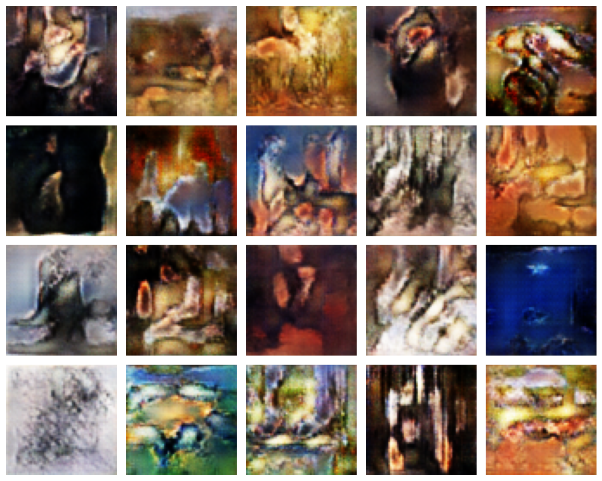

# Simple GAN on Art

This project implements a Generative Adversial Network (GAN) using PyTorch. GANs are made up of two neural networks, a discriminator and a generator. They use adversarial training to produce artificial data that is identical to actual data.

## Dataset

The dataset was obtained from [kaggle](https://www.kaggle.com/code/isaklarsson/gan-art-generator/input). It consists of about 8,000 paintings of popular artists as mentioned in WikiArt. Folder structure of dataset folder is given below :

```
data/
├── images/
│   ├── artist-1/
│   │   ├── image-1
│   │   ├── image-2
│   │   └── ...
│   └── artist-2/
│       ├── image-1
│       ├── image-2
│       └── ...
├── resized/
│   ├── image-1
│   ├── image-2
│   └── ...
└── artists.csv
simple_art_gan/
├── __init__.py
└── gan.ipynb
```

## Installation

Make sure to have [python-poetry](https://python-poetry.org/) installed. A computer with adequate GPU is recommended.

```
poetry install
```

## Usage

You can either run the whole notebook which involves training the GAN for 50 epochs. A decent GPU is required if doing so. Or you could just skip to the section titled "Generating New Images" to load the model from weights files.

## Results



